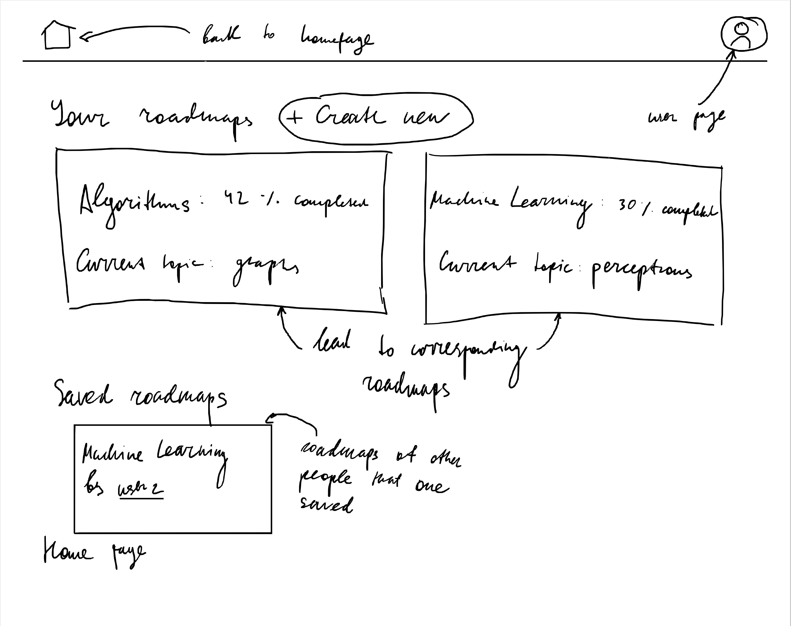
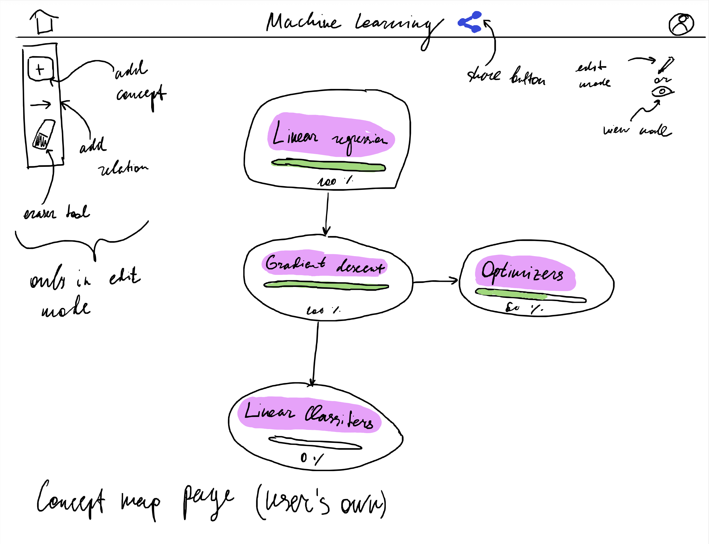
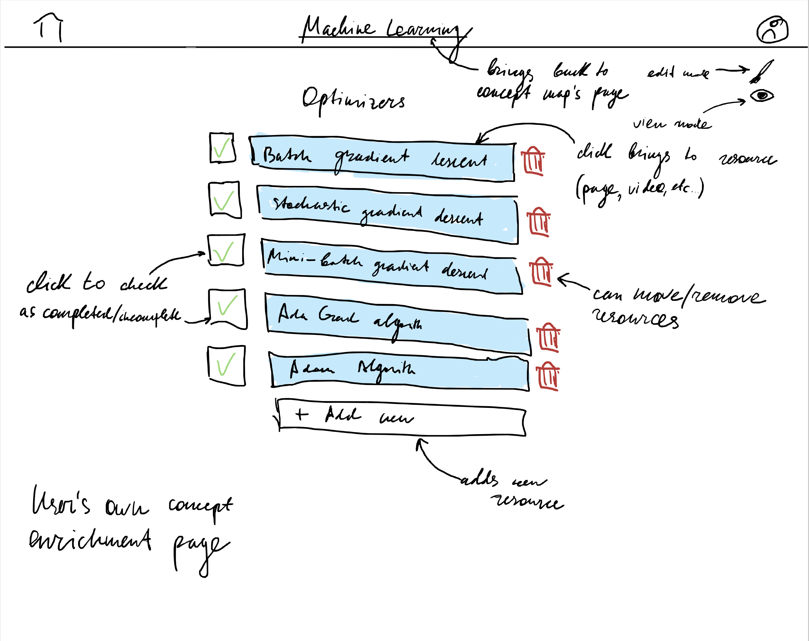
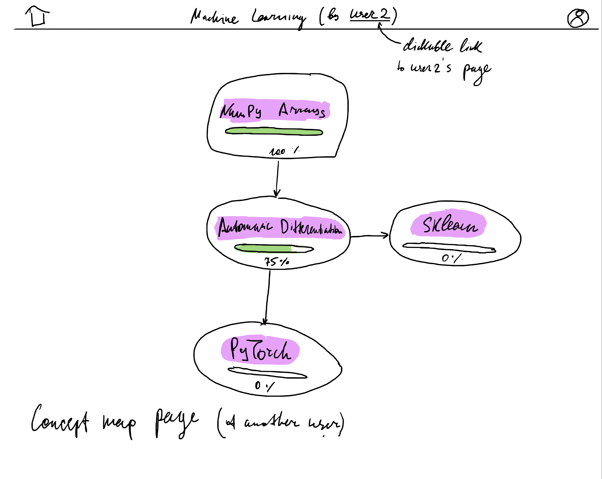
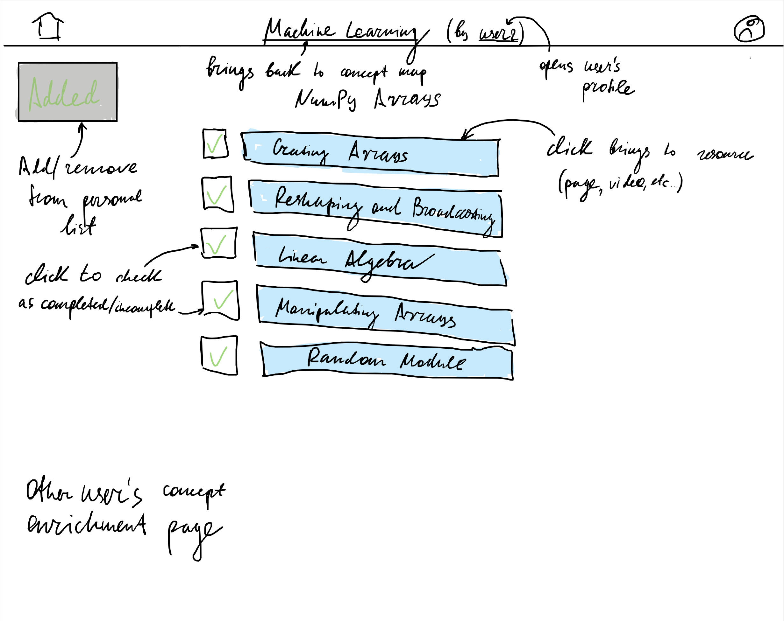
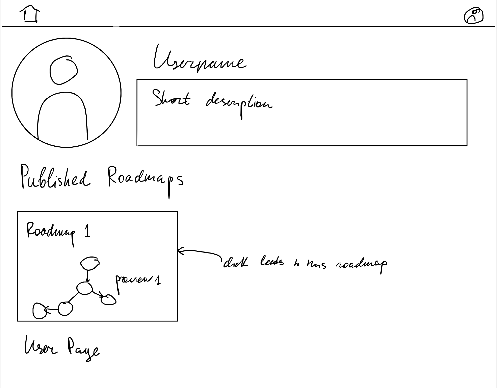

# Assignment 2: Functional design

## Problem statement

### Problem domain: Direction in studying and learning

The challenge of self-directed learning has become increasingly relevant as more
people seek to acquire new skills and knowledge outside of traditional educational
institutions. This problem is relevant for me, because it is impossible to do
state-of-the-art research or engineering without learning advanced topics on my own,
without multidirectional support from the actual educational institution. There were
multiple times when I tried to dive into some new field of study, but ultimately
failed, for multiple reasons. This way, I would like to optimize the way I learn new
complicated, but useful things.

### Problem description

Students, professionals, and lifelong learners often struggle with coming up with
structured, effective learning paths for topics they want to master. Also, if the path
istelf is very convoluted and complex, it is not only hard to stick to it, but it is
also challenging to keep track of the progress, which can be frustrating and
demotivating. This way, there is a need for a tool that would allow to create learning
paths, which can be easily customized, visually tracked, potentially shared with other
learners, but most importantly, they should be structured by design.

### Stakeholders

+ Students and self-learners, who can benefit from the ability to create and share
  their learning paths, resources, and progress.
+ Educational institutions, the students of which can start spending more time on
  self-learning, and also the educational materials of which can be used to create
  the learning paths.
+ Providers of learning materials, such as courses, books, tutorials, videos, etc.,
  as they can be used to enrich the learning paths and make them more effective.

### Evidence and comparables

+ [NeetCode](https://neetcode.io/) is a platform that provides a roadmap with
  different topics and LeetCode problems for each of them, which helps prepare for
  coding interviews.
+ [Quantapus](https://quantapus.com/) is a platform that provides a roadmap graph with
  nodes representing important topics relevant to quantitative research interviews,
  and each node containing a list of resources to learn about the topic.
+ [Deep-ML](https://deep-ml.com/) has collections of exercises for different topics in
  machine learning, as well as short theoretical background for each problem.
+ In his book *Ultralearning* by Scott Young, he discusses the importance of
  **metalearning**, i.e. learning how to learn. Creating a roadmap for learning a new
  topic, reconsidering it whenever seems necessary, and making it as flexible and
  consequential as possible is a key to successful learning.
+ Learning paths are somewhat similar to concept maps, which are proven to be
  [effective](https://pmc.ncbi.nlm.nih.gov/articles/PMC8788906/), but they just
  contain concepts and how are they related to each other. Learning paths are more
  flexible in this manner, allowing to not only map concepts and their relations, but
  also to enrich them with resources, exercises, and benchmarks.

## Application

### Name

I've chosen the name *RoadBuilder.io*. It emphasizes the fact that the main feature of
the application is creating learning paths (roadmaps), and also implies that the user
will be able to build their own roadmaps, as the process of creating them is great
for learning on itself.

### Motivation

The main problem that this application solves is the difficulty of creating
structured, visually intuitive, and easily sharable learning paths, which can be
customized and enriched with resources, exercises, and benchmarks.

### Key features

1. **Concept map creation**. This feature allows the user to create a concept map,
   i.e. a graph of concepts as nodes and how are they related to each other as edges
   (e.g. if one of concepts is a prerequisite for learning another one). This allows
   for the visualization of the learning path, provides a logical sequence of
   learning steps, and makes it easier to mentally navigate different concepts in the
   field of interest. One user can create multiple concept maps for different topics.
2. **Enriching the concept**. This feature allows the user to add resources, exercises,
   and benchmarks to the concepts in the concept map. This allows the user to have
   control over the actual steps taken in the learning process, e.g. exactly which
   books to read, which videos to watch, or which problems to solve.
3. **Tracking the progress**. This feature allows the user to track the progress of
   learning each concept by marking learning steps/whole concepts as completed. This
   allows the user to clearly observe the progress of the learning process, and to be
   motivated to continue learning.
4. **Sharing the learning path**. This feature allows the user to share their learning
   path with other users, the most convenient way to do so is to just share a link to
   the created learning path. Other users can then view the learning path and keep
   track of their own progress on it, and also potentially discuss the learning path
   with other users. This allows for collaborative learning, which is good for
   engagement and motivation.

## Concept Design

**concept** `RoadBuilder` [`User`]\
**purpose** Store a certain roadmap for a given user\
**principle** A user can create a learning path for a given topic, and then add\
  concepts and realtions between them.\
**state**\
  a set of `RoadMap`s with\
    a user `User`\
    a title `String`\
**actions**\
  `createRoadMap`(`user`: `User`, `title`: `String`): (`roadMap`: `RoadMap`)\
    **requires** User doesn't have a roadmap with the same title\
    **effects** Creates a new roadmap with the provided `user` and `title`\
  `deleteRoadMap`(`roadMap`: `RoadMap`, `user`: `User`)\
    **requires** User has the provided `roadMap`\
    **effects** Deletes the roadmap with the provided `roadMap`\
  `getUserRoadMap`(`user`: `User`, `title`: `String`): (`roadMap`: `RoadMap`)\
    **requires** User has a roadmap with the provided `title`\
    **effects** Returns the roadmap with the provided `title`\
  `validateAccess`(`roadMap`: `RoadMap`, `user`: `User`)\
    **requires** User has the provided `roadMap`\
    **effects** Validates the access to the provided `roadMap`

**concept** `ConceptGraph` [`Parent`]\
**purpose** Manage the structure of concepts and their relationships within a parent structure (e.g. roadmap)\
**principle** Users can add/remove concept nodes and create/remove prerequisite\
  relationships between concepts.\
**state**\
  a set of `Node`s with\
    a parent `Parent`\
    a title `String`\
  a set of `Edge`s with\
    a source node `Node`\
    a target node `Node`\
**actions**\
  `addConcept`(`roadMap`: `RoadMap`, `title`: `String`): (`concept`: `Node`)\
  **requires** There is no node with the provided `title` in the set of nodes\
    associated with the provided `roadMap`\
  **effects** Adds a new node with the provided `title` to the set of nodes\
    associated with the provided `roadMap`\
  `removeConcept`(`concept`: `Node`)\
    **requires** There is the provided `concept` in the set of nodes\
    **effects** Removes the provided `concept` from the set of nodes and all edges\
      that have it as a source or target node\
  `addEdge`(`sourceConcept`: `Node`, `targetConcept`: `Node`)\
    **requires** There is no edge with the provided `sourceConcept` and\
       `targetConcept`, `sourceConcept` and `targetConcept` belong to the same roadmap\
    **effects** Adds a new edge with the provided `sourceConcept` and `targetConcept`\
       to the set of edges\
  `removeEdge`(`sourceConcept`: `Node`, `targetConcept`: `Node`)\
    **requires** There is an edge between the provided `sourceConcept` and `targetConcept`\
    **effects** Removes the edge with the provided `sourceConcept` and `targetConcept` from\
      the set of edges\
  `clearGraph`(`parent`: `Parent`)\
    **requires** nothing\
    **effects** Removes all nodes that are associated with the provided `parent` from the set\
      of nodes and all edges associated with such nodes from the set of edges

**concept** `ResourceManager` [`Resource`, `Group`]\
**purpose** Attach and manage resources associated with concepts (abstract groups)\
**principle** Users can add various types of resources (books, videos, exercises, etc.)\
  to concepts concepts and remove them.\
**state**\
  a set of `IndexedResource`s with\
    a group `Group`\
    an index `Number`\
    a resource `Resource`\
**actions**\
  `addResource`(`group`: `Group`, `resource`: `Resource`): (`indexedResource`: `IndexedResource`)\
    **requires** There is no indexed resource with the provided `resource` in the set of resources\
    that have the same associated `group` as the provided `group`\
    **effects** Adds a new indexed resource with the provided `resource` associated with\
      the provided `group` and index `Number` that is one more than the last index\
      of indexed resources associated with the provided `group` to the set of indexed\
      resources and returns the new indexed resource. If there were no indexed resources\
      associated with the provided `group`, the index is 0\
  `removeResource`(`group`: `Group`, `resource`: `Resource`)\
    **requires** There is indexed resource with the provided `resource` associated\
      with provided `group` in the set of indexed resources\
    **effects** Removes the provided `resource` from the set of resources\
  `exchangeResources`(`idxResource1`: `IndexedResource`, `idxResource2`: `IndexedResource`)\
    **requires** There are indexed resources with the provided `idxResource1` and\
      `idxResource2` in the set of indexed resources\
    **action** Exchanges the indexes of the provided `idxResource1` and\
      `idxResource2` in the set of indexed resources.\
  `clearResources`(`group`: `Group`)\
    **requires** nothing\
    **effects** Removes all indexed resources associated with the provided `group` from the set\
      of indexed resources

**concept** `ResourceSharing` [`OnlineResource`, `URL`]\
**purpose** Enable sharing of resources through shareable URLs\
**principle** Users can generate shareable URLs for their roadmaps and others can access\
  them.\
**state**\
  a set of `SharedURL`s with\
    a online resource `OnlineResource`\
    a shareable URL `URL`\
**actions**\
  `generateShareLink`(`onlineResource`: `OnlineResource`): (`url`: `URL`)\
    **requires** nothing\
    **effects** if there is not a `SharedURL` with the provided `onlineResource` in the set of\
      `SharedURL`s, generates a new unique `URL` and adds it to the set of `SharedURL`s\
      associated with the provided `onlineResource`. If there is a `SharedURL` with the provided\
      `onlineResource` in the set of `SharedURL`s, returns the `URL` associated with the provided\
      `onlineResource`\
  `accessResource`(`url`: `URL`): (`onlineResource`: `OnlineResource`)\
    **requires** There is a `SharedURL` with the provided `url` in the set of `SharedURL`s\
    **effects** Returns the `OnlineResource` associated with the provided `URL`\
  `removeShareLink`(`onlineResource`: `OnlineResource`)\
    **requires** There is a `SharedURL` with the provided `onlineResource` in the set of `SharedURL`s\
    **effects** Removes the `SharedURL` with the provided `onlineResource` from the set of `SharedURL`s

**concept** `ResourceProgress`[`User`, `Resource`]\
**purpose** Track the progress of learning resources associated with concepts for a given user\
**principle** Users can mark resources as completed or incompleted, and it is going to be visible only\
  to them\
**state**\
  a set of `ResourceProgress`es with\
    a resource `Resource`\
    a completed status `Boolean`\
  a set of `PersonalProgress`s with\
    a user `User`\
    a personal progress `ResourceProgress`\
**actions**\
  `addResource`(`user`: `User`, `resource`: `Resource`)\
    **requires** nothing\
    **effects** Adds a new `ResourceProgress` with the provided `resource` and incomplete status to the set\
      of `ResourceProgress`es and adds a new `PersonalProgress` with the provided `user` and the new\
      `ResourceProgress` to the set of `PersonalProgress`es\
  `markAsCompleted`(`user`: `User`, `resource`: `Resource`)\
    **requires** In the set of `PersonalProgress`es there is a `PersonalProgress` with the provided\
      `user` and in the set such that its `resource` is the provided `resource` and its status is incomplete\
    **effects** Marks the `ResourceProgress` associated with the provided `user` and `resource` as completed\
  `markAsIncomplete`(`user`: `User`, `resource`: `Resource`)\
    **requires** In the set of `PersonalProgress`es there is a `PersonalProgress` with the provided\
      `user` and in the set such that its `resource` is the provided `resource` and its status is completed\
    **effects** Marks the `ResourceProgress` associated with the provided `user` and `resource` as incomplete
  `removeProgress`(`user`: `User`, `resource`: `Resource`)\
    **requires** In the set of `PersonalProgress`es there is a `PersonalProgress` with the provided\
      `user` and with its `ResourceProgress` associated with the provided `resource`\
    **effects** Removes the `PersonalProgress` with the provided `user` and `ResourceProgress` associated\
      with the provided `resource` from the set of `PersonalProgress`es and removes the `ResourceProgress`\
      that was associated with removed `PersonalProgress` from the set of `ResourceProgress`es.
  `removeAllProgresses`(`resource`: `Resource`)\
    **requires** nothing\
    **effects** Removes all `PersonalProgress`es associated with the provided `resource` from the set\
      of `PersonalProgress`es and all `ResourceProgress`es from the set of `ResourceProgress`es

There are multiple essential synchronizations that we need to consider. When user
creates a new roadmap, we just create a new `RoadMap` in the state of `RoadBuilder`
concept. However, deleting a roadmap is a bit more complicated, as it involves
deleting concepts and resources associated with it.

**sync** `roadmapDeletion`\
**when**\
  `Request.deleteRoadMap` (`user`, `roadMap`)\
  `RoadBuilder.validateAccess` (`roadMap`, `user`)\
**then**\
  `RoadBuilder.deleteRoadMap` (`roadMap`, `user`)\
  `ConceptGraph.clearGraph` (`roadMap`)\
  `ResourceSharing.removeShareLink` (`roadMap`)\
  `ResourceProgress.removeProgress` (`user`, `roadMap`)

Also `ResourceManager` concept needs to be synchronized, but I'm not sure how to
describe iterative removal of resources associated with multiple `Node`s in the
concept description language.

Similarly, when removing just one concept from the roadmap, we need to remove all
resources associated with it from the set of indexed resources.

**sync** `conceptRemoval`\
**when**\
  `Request.removeConcept` (`user`, `roadMap`, `concept`)\
  `RoadBuilder.validateAccess` (`roadMap`, `user`)\
**then**\
  `ConceptGraph.removeConcept` (`concept`)\
  `ResourceManager.clearResources` (`concept`)\
  `ResourceProgress.removeAllProgresses` (`concept`)

Adding resources to a concept is straightforward, as we just add a new
`IndexedResource` to the set of indexed resources associated with the provided concept
and also new `PersonalProgress` to the set of `PersonalProgress`es associated with the
provided `user` and the new `ResourceProgress`.

**sync** `resourceAddition`\
**when**\
  `Request.addResource` (`user`, `roadMap`, `concept`, `resource`)\
  `RoadBuilder.validateAccess` (`roadMap`, `user`)\
**then**\
  `ResourceManager.addResource` (`concept`, `resource`)\
  `ResourceProgress.addResource` (`user`, `resource`)

And finally, when removing a resource from the concept, we need to also remove it from
progress tracking.

**sync** `resourceRemoval`\
**when**\
  `Request.removeResource` (`user`, `roadMap`, `concept`, `resource`)\
  `RoadBuilder.validateAccess` (`roadMap`, `user`)\
**then**\
  `ResourceManager.removeResource` (`concept`, `resource`)\
  `ResourceProgress.removeAllProgresses` (`resource`)

These concepts are important for multiple reasons. First, we want to be able to
segregate diffrerent roadmaps and allow users to have multiple roadmaps for different
topics, so we need a `RoadBuilder` concept. Secondly, on the surface level, each
roadmap is just a graph of concepts and their relationships, so we need a `ConceptGraph`
concept, which includes the ability to create and remove concepts (represented as
nodes) and to associate them with abstract parent (which is a roadmap in our case).
Graph should be modifiable, but only by the owner of the roadmap, hence the
`validateAccess` action that is involved in the syncs. For each concept, we want to be
able to associate resources (abstract, for now) with it, so we need a `ResourceManager`
concept that keeps track of all resources associated with a given abstract group
(which is just a concept in our case). `ResourceManager` also keeps track of the index
of each resource, creating the order of resources associated with a given concept,
and also allows to remove/exchange resources, giving the user control over the order
of resources. Users should also be able to share their roadmaps with other users, so we
need a `ResourceSharing` concept that allows to generate shareable URLs for roadmaps
and access them by the generated URLs, and also allows to remove the shareable URLs
when the roadmap is deleted. Finally, we want to be able to track the progress of
learning resources associated with concepts, so we need a `ResourceProgress` concept
that allows to mark resources as completed or incomplete, and it is linked to deletion
and removal of resources via syncs.

## UI Sketches

The user lands on the home page, from where they can go to their profile page, to roadmaps created
by them, or to roadmaps of other users that they saved.

When the user is on the concept map page of their roadmap, they can see the concept
map itself, share it, add/remove concepts and relationships between them, progress on
different concepts, and open the resource page for each concept.

When the user is on the resource page of a concept associated with their roadmap, they
can see the resources, add new ones or remove existing ones, and mark them as completed or incomplete.

The user can also open other users' roadmaps, but they can't edit them. Other users'
concept maps lack editing features, but still allow to view the resources and track
the progress on them. The user can also visit other users' profile pages.

On the resource page of another user's concept, the user can see the resources and
track the progress on them, but they can't edit them. They can also save the roadmap
to access it later.

The user can also visit other users' profile pages, where they can see the roadmaps
they created and shared.

## User Journey

The user lands on the home page, creates their first roadmap, adds concepts to it and
connectes them with each other. After doing some metalearning, they add learning resources
(videos, books, exercises, etc.) to the concepts. After that, they can share their roadmap
or just keep it private and follow them on their own by checking the progress in each
concept.

The user can also open links to other users' roadmaps, potentially saving them for later.
On other users' concept maps and resource pages, they can view the concepts and resources,
and check their own progress on them, as they progress through the concepts and resources.